# Unikernels vs. Containers: A Runtime-Level Performance Comparison for Resource-Constrained Edge Workloads

> **Published Paper:** [IEEE Xplore - DOI: 10.1109/11410140](https://ieeexplore.ieee.org/document/11410140)

## Abstract

The choice between containers and unikernels is a critical trade-off for edge applications, balancing the container's ecosystem maturity against unikernel's specialized efficiency. This work presents an empirical comparison using **Go** and **Node.js** applications, representing ahead-of-time (AOT) and just-in-time (JIT) compilation, respectively. While unikernels consistently deliver faster startup times and outperform containers for Go-based workloads in resource-constrained environments, the evaluation identifies a **critical performance crossover for Node.js**: below a certain memory threshold, Docker containers maintain stable performance, while the Nanos unikernel's performance degrades sharply. This challenges the assumption that unikernels are universally superior for edge computing and highlights the need for deployment decisions informed by workload type, execution model, and resource constraints.

<p align="center">
  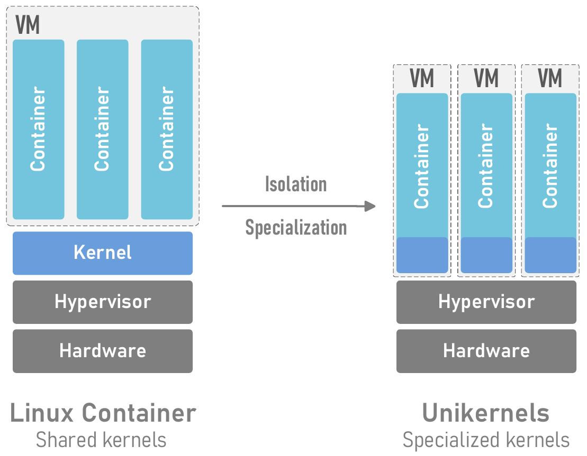
</p>
<p align="center"><em>Architectural comparison showing a Linux container's reliance on a shared host kernel versus a unikernel's specialized, self-contained design running on a hypervisor.</em></p>

## Key Contributions

1. **Performance crossover point for JIT runtimes:** Unikernels perform better with sufficient resources, but below a memory threshold, Docker's mature Linux environment maintains stable performance while unikernel latency and throughput degrade significantly.
2. **Linking execution model to deployment paradigm:** For AOT workloads (Go), unikernels consistently outperform containers under resource-limited conditions. For JIT workloads (Node.js), Docker offers greater stability.
3. **Decision framework for deployment choice:** Practical guidance for selecting the appropriate deployment model based on workload type, execution model, and system constraints.

## Experimental Setup

Experiments were conducted on two dedicated servers in the same data center:

| Component | Specification |
|-----------|--------------|
| **CPU** | Intel Xeon E3-1275 v6 (4 cores, 8 threads, 3.80 GHz) |
| **Memory** | 64 GB DDR4 ECC RAM |
| **Network** | 1 Gbps full-duplex |
| **OS** | Ubuntu 24.04.2 LTS, Linux kernel 6.8.0 |
| **Container Runtime** | Docker v28.3.1 |
| **Unikernel Runtime** | Nanos v0.1.54 with ops v0.1.43 via QEMU v8.2.2 |

Two functionally identical applications were developed in **Go (v1.22.2)** and **Node.js (v24.3.0)**, each exposing:
- **I/O-Bound Workload (`/io`):** Returns a simple response to evaluate networking and scheduling performance.
- **CPU-Bound Workload (`/compute`):** Executes a 100-iteration SHA-256 hashing loop to stress computational performance.

Tests were run under two scenarios:
- **Resource-Rich:** 8 CPU cores, 2048 MB RAM (well-provisioned edge server)
- **Resource-Constrained:** 1 CPU core, memory varied across 512/256/128/64 MB (industrial edge devices)

## Results

### Static Properties: Image Size and Startup Time

<p align="center">
  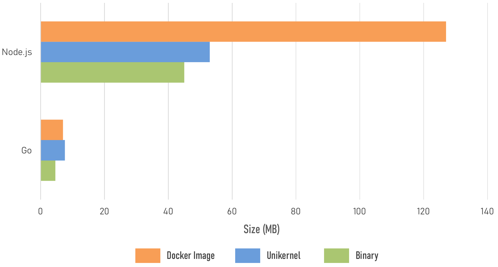
  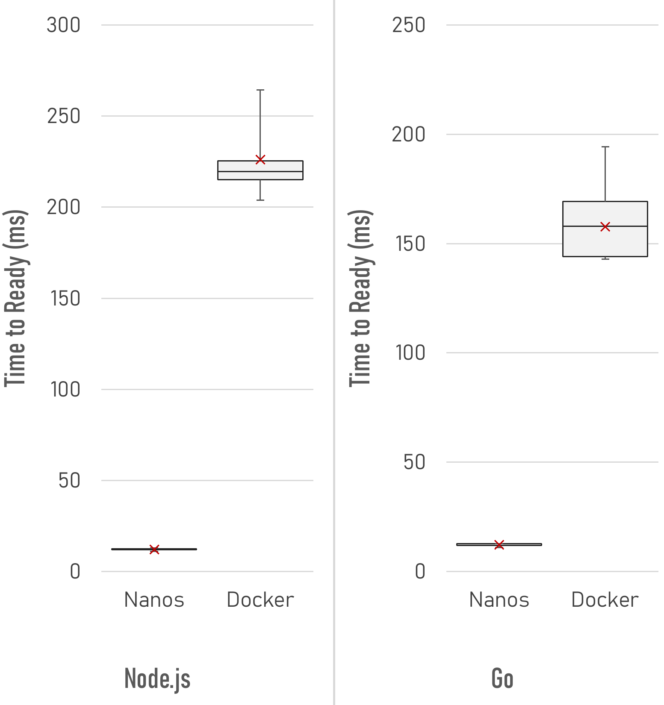
</p>

| Metric | Go (Docker) | Go (Nanos) | Node.js (Docker) | Node.js (Nanos) |
|--------|------------|------------|-----------------|-----------------|
| **Image Size** | 7.0 MB | 7.6 MB | 127.0 MB | 53.0 MB |
| **Time to Ready** | 158 ms | 12 ms | 219.5 ms | 12 ms |

- Unikernels achieve **13x-18x faster startup** than containers.
- For Node.js, Nanos achieves a **2.4x image size reduction** over Docker by removing the guest OS layer.

### I/O-Bound Workload

<p align="center">
  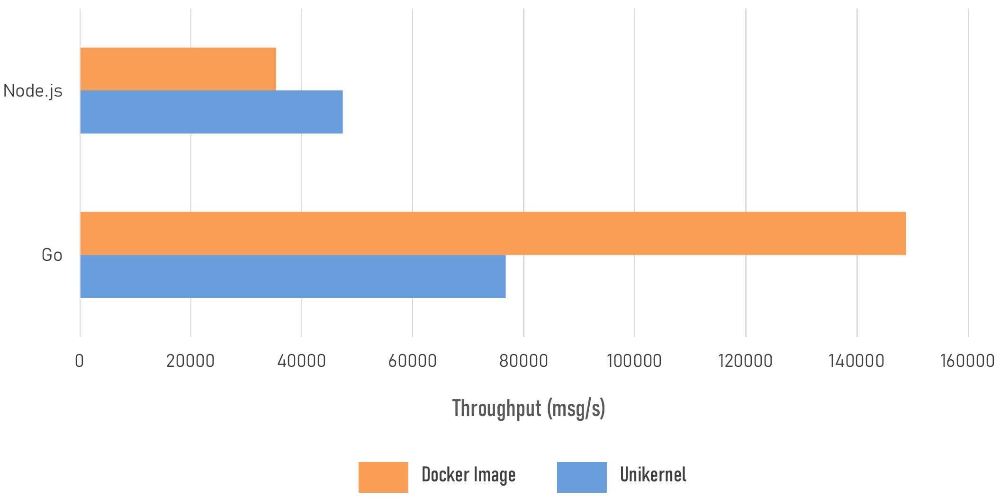
</p>
<p align="center"><em>I/O throughput in the resource-rich scenario.</em></p>

<p align="center">
  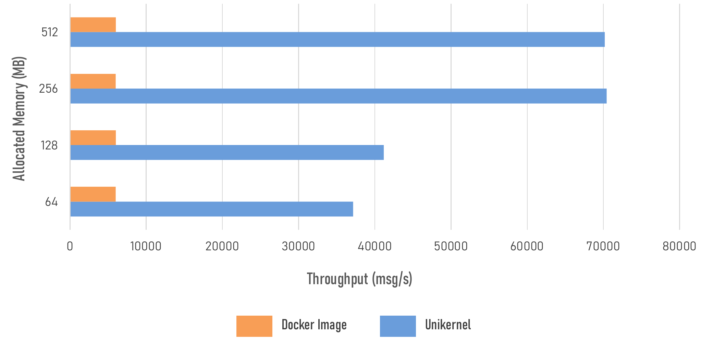
  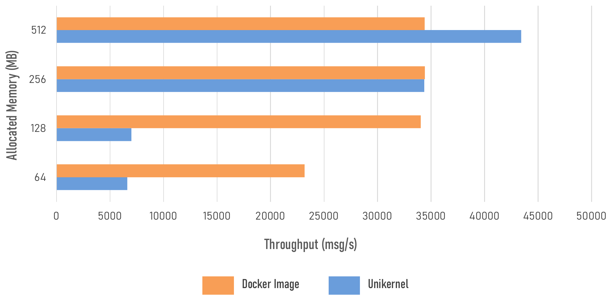
</p>
<p align="center"><em>I/O throughput under resource constraints: Go (left) vs. Node.js (right).</em></p>

<p align="center">
  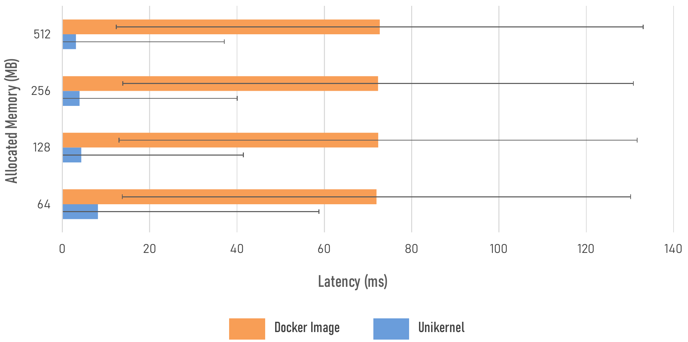
  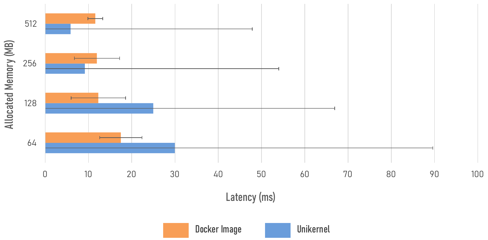
</p>
<p align="center"><em>I/O latency under resource constraints: Go (left) vs. Node.js (right).</em></p>

**Key findings:**
- In resource-rich multi-core scenarios, Docker outperforms Nanos for Go due to the host's optimized kernel-level networking stack.
- For single-threaded Node.js, Nanos outperforms Docker as the unikernel's minimal overhead allows the event loop to run more efficiently.
- Under resource constraints, Go on Nanos outperforms Docker by an order of magnitude. Node.js on Nanos suffers sharp degradation below 128 MB.

### CPU-Bound Workload

<p align="center">
  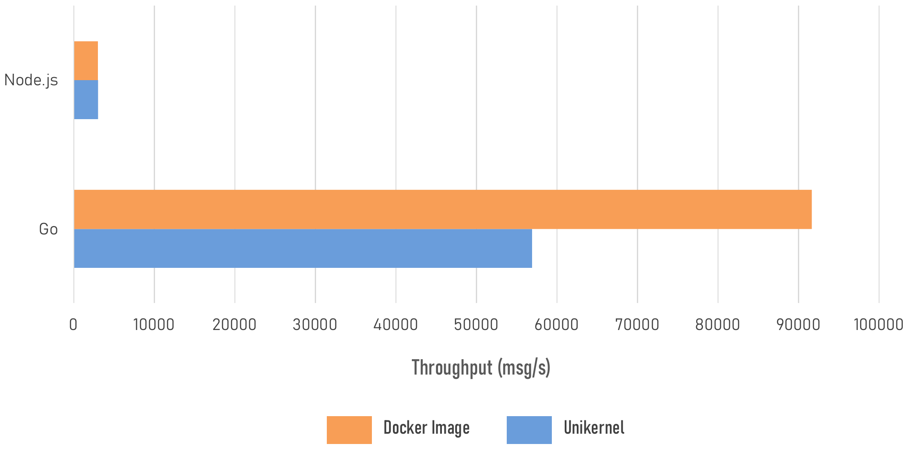
</p>
<p align="center"><em>CPU throughput in the resource-rich scenario.</em></p>

<p align="center">
  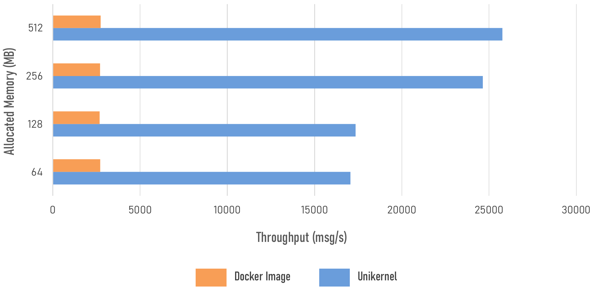
  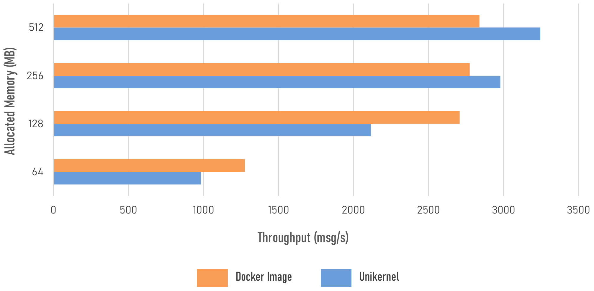
</p>
<p align="center"><em>CPU throughput under resource constraints: Go (left) vs. Node.js (right).</em></p>

<p align="center">
  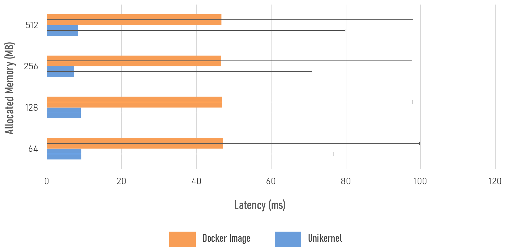
  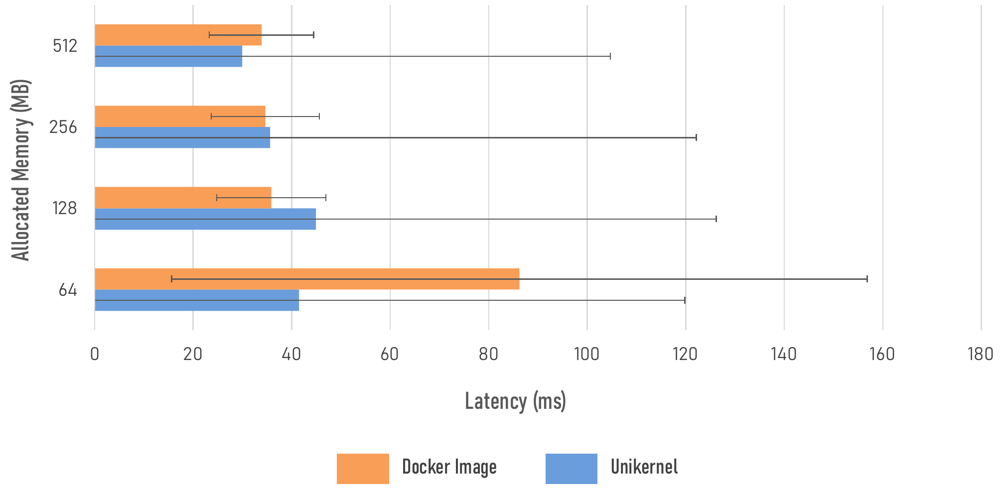
</p>
<p align="center"><em>CPU latency under resource constraints: Go (left) vs. Node.js (right).</em></p>

**Key findings:**
- Go outperforms Node.js by up to **30x**, demonstrating AOT compilation benefits.
- In multi-core environments, Docker achieves higher throughput for Go due to the mature Linux scheduler.
- In single-core constrained environments, Nanos consistently outperforms Docker for Go.
- For Node.js under severe memory constraints, Docker maintains more stable performance.

## Decision Framework

Based on the empirical results, the paper proposes the following deployment guidance:

| Scenario | Recommended Paradigm |
|----------|---------------------|
| **Time-sensitive compute on constrained edge** (analytics, signal processing) | **Unikernel + AOT language** (Go/Rust) |
| **JIT runtimes on memory-constrained edge** (Node.js, Java, Python) | **Docker containers** (Linux kernel stability) |
| **High-throughput on well-provisioned multi-core servers** (parallel runtimes) | **Docker containers** (optimized Linux scheduler) |
| **Single-threaded runtimes on provisioned servers** | **Unikernel** (minimal overhead advantage) |

## Repository Structure

```
.
├── go-http-app/          # Go HTTP server (I/O-bound workload)
├── go-compute-app/       # Go compute server (CPU-bound workload)
├── node-http-app/        # Node.js HTTP server (I/O-bound workload)
├── node-compute-app/     # Node.js compute server (CPU-bound workload)
├── post.lua              # wrk POST script for compute benchmarks
├── generate_system_report.sh  # System info collection script
└── docs/figures/         # Figures from the paper
```

Each application exposes:
- `GET /hello` or `GET /io` - Simple HTTP response (I/O-bound benchmark)
- `POST /compute` - 100-iteration SHA-256 hashing (CPU-bound benchmark)

## Running the Benchmarks

Benchmarks are performed using [`wrk`](https://github.com/wg/wrk):

```bash
# I/O-bound workload
wrk -t4 -c100 -d30s http://localhost:8080/hello

# CPU-bound workload
echo '{"data":"your_payload_here"}' | \
wrk -t4 -c100 -d30s -s post.lua http://localhost:8080/compute
```

## Citation

If you use this work, please cite:

```bibtex
@inproceedings{dinhtuan2025unikernels,
  title={Unikernels vs. Containers: A Runtime-Level Performance Comparison for Resource-Constrained Edge Workloads},
  author={Dinh-Tuan, Hai},
  booktitle={IEEE International Conference},
  year={2025},
  doi={10.1109/11410140}
}
```

## License

This project is provided for research and educational purposes. Please refer to the [published paper](https://ieeexplore.ieee.org/document/11410140) for detailed methodology and analysis.
